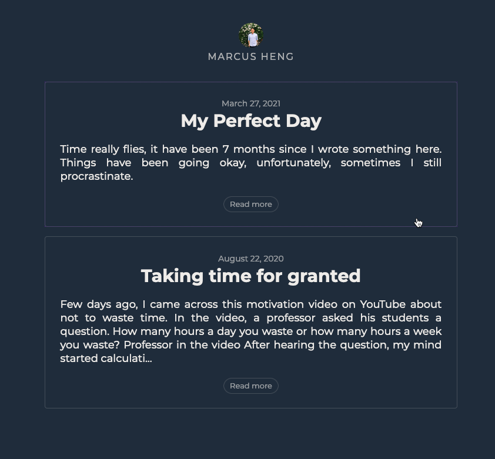

# hey-world

This theme is inspired by Hey by Basecamp. They have recently introduce https://hey.com/world/ and I really like the minimal look for the blogging page. Here is one example by [DHH](https://world.hey.com/dhh/).

This is what this theme looks like for a jekyll project:


Or you can visit [my blog](https://marcushwz.netlify.app/) where I have hosted it on Netlify using this theme.

## Usage

This theme is tested to be working on Netlify, simply follow the installation procedures below and you will have the theme in place.
The idea of this theme is to keep things very minimal, so the theme is mainly focusing on the index.html and page.html. There are no suport for `Tag or Categories` for now.

This theme is not tested on GitHub Pages, but it seems like GitHub Pages does not support gem based theme. So you mmight have to copy those necessary folders to your Jekyll project if you are planning to host your blog on GitHub Pages.


## Installation

Add this line to your Jekyll site's `Gemfile`:

```ruby
gem "hey-world"
```

And add this line to your Jekyll site's `_config.yml`:

```yaml
theme: hey-world
```

And then execute:

    $ bundle

Or install it yourself as:

    $ gem install hey-world


## License

The theme is available as open source under the terms of the [MIT License](https://opensource.org/licenses/MIT).

